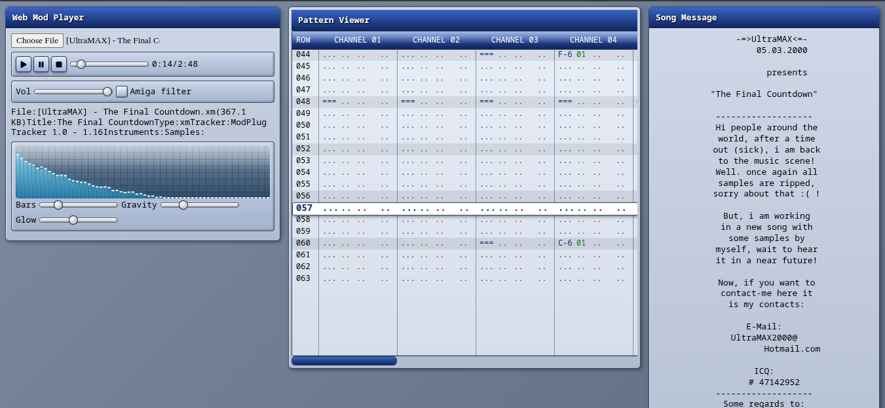

# 🎵 Web Mod Player — AmigaOS 3 GlowIcons Edition

A browser-based **MOD/XM/S3M/IT tracker music player** with a retro **Amiga GlowIcons-inspired** interface.  
Made as a fun side project to learn, experiment, and bring back a bit of 90s nostalgia ✨.

---

## 🚀 Features

- Load and play a wide variety of module formats (`.mod`, `.xm`, `.s3m`, `.it`, and many more).  
- Classic **Amiga filter toggle** 🎚️.  
- Volume control and seek bar.  
- **Pattern Viewer** — real-time scrolling pattern data with per-channel notes, instruments, volume, and effects.  
- **Spectrum Visualizer** — bars with glow, gravity, and customizable size.  
- Displays metadata (title, tracker, instruments, samples).  
- Shows song messages embedded in modules.  
- Multiple subsong support with previous/next buttons.  
- Fully styled with retro-inspired **GlowIcons palette + glossy UI**.  

---

## 🛠️ Tech Stack

- **HTML5 / CSS3** — UI and retro theming.  
- **JavaScript (Vanilla)** — audio, rendering, and player logic.  
- **[libopenmpt](https://lib.openmpt.org/)** (compiled to WebAssembly) — tracker module playback.  
- **Canvas API** — for pattern rendering and spectrum visualization.  

---

## 📂 Project Structure

- `index.html` — main layout and UI windows.  
- `style.css` — retro GlowIcons-inspired look & feel.  
- `player.js` — audio engine, visualizer, and pattern renderer.  
- `libopenmpt.js` — WebAssembly backend for module playback.  

---

## ▶️ How to Use

1. Clone or download the repo.
2. Serve the project with any local web server (examples: `python -m http.server` or `live-server`).  
   > Opening directly as a file may not work due to browser restrictions.  
3. Open in your browser and load a module file (`.mod`, `.xm`, `.s3m`, etc).  
4. Enjoy some tracker nostalgia!  

---

## 💡 Why?

This project was made **for learning, for fun, and out of nostalgia**.  
Growing up with tracker music and Amiga-style UIs left a mark, and this is a little throwback project to recreate some of that magic in the browser.  

---

## 📜 License

This project is released under the **MIT License**.  
libopenmpt is licensed under BSD and LGPL (see their project for details).  

---

👾 *Made with love for retro computing, tracker music, and good old hack-around fun.*
